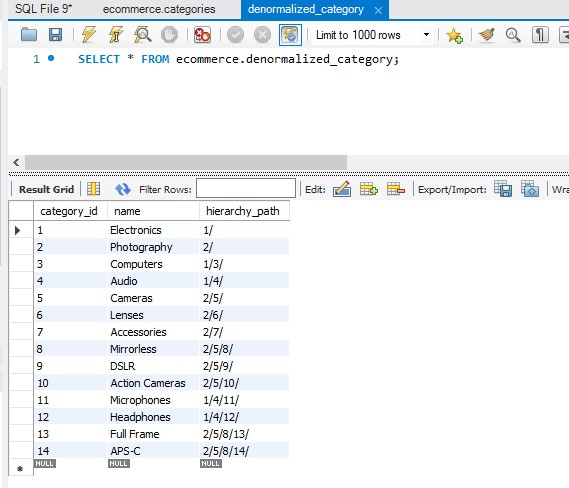
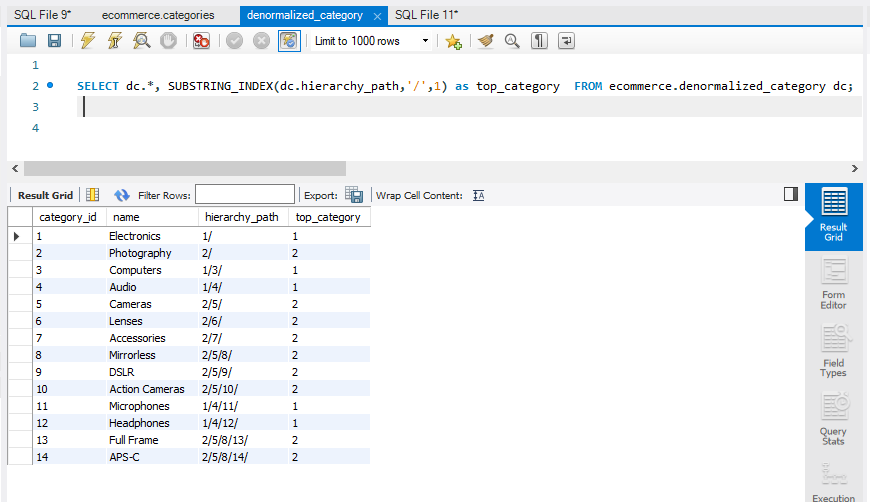
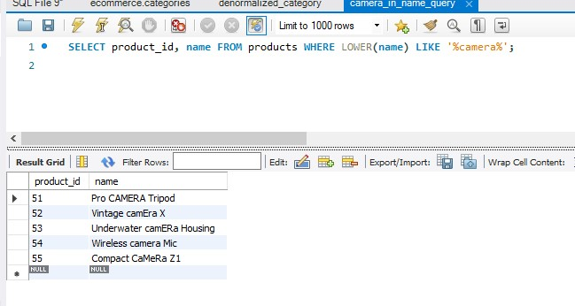
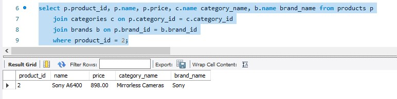
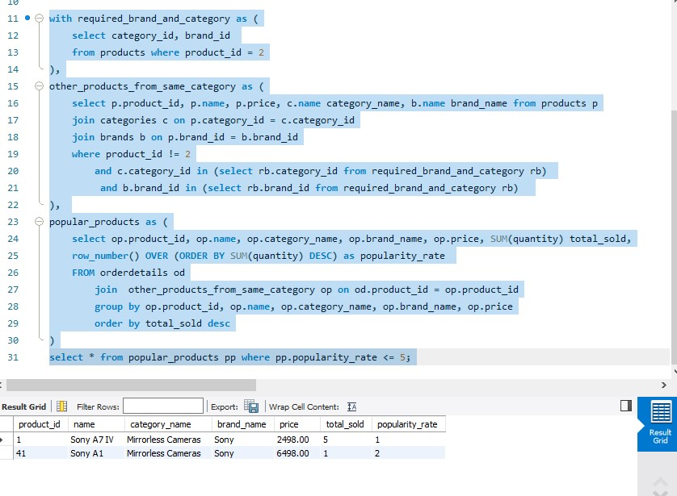

# Mentorship E-commerce System

## Week 04
### Denormalized Tables with Recursive Relationships
- Task: denormalize category table that has a recursive relationship.

We can add a new column to the category table called hierarchy_path, which store the full path up to the parent node. My initial thought was that we can use json to do that, but while searching I found that there is a syntax commonly used,
which is  '/1/2/4', known as the materialized path.

#### AI Generated Data


#### SQL Query to fetch Top Level Categories
```roomsql
SELECT dc.*, SUBSTRING_INDEX(dc.hierarchy_path,'/',1) as top_category  FROM ecommerce.denormalized_category dc;

```
Example of the output of the above query:


- One more enhancment is create a function that fetches the category of the specified level, or the last level available.

### Products with Specific Keyword
- Task: Write a SQL query to search for all products with the word "camera" in either the product name or description.
```roomsql
SELECT product_id, name FROM products WHERE LOWER(name) LIKE '%camera%';
```
Example of the output of the above query:


### Top 5 Popular Products for in The Same Category for The Same Brand
- Task: Can you design a query to suggest popular products in the same category for the same author, excluding the Purchsed product from the recommendations?

Bought product:


Products Similar to the Bought Product:
```roomsql
with current_product as (
    select product_id, category_id, brand_id
    from products where product_id = 2
),
other_products_from_same_category as (
    select p.product_id, p.name, p.price, c.name category_name, b.name brand_name from products p
    join categories c on p.category_id = c.category_id
    join brands b on p.brand_id = b.brand_id
    where product_id not in (select product_id from current_product cp)
        and c.category_id in (select cp.category_id from current_product cp)
         and b.brand_id in (select cp.brand_id from current_product cp)
),
popular_products as (
    select op.product_id, op.name, op.category_name, op.brand_name, op.price, SUM(quantity) total_sold,
    row_number() OVER (ORDER BY SUM(quantity) DESC) as popularity_rate
    FROM orderdetails od
        join  other_products_from_same_category op on od.product_id = op.product_id
		group by op.product_id, op.name, op.category_name, op.brand_name, op.price
		order by total_sold desc
)
select * from popular_products pp where pp.popularity_rate <= 5;
```

Example of the output of the above query:


---
