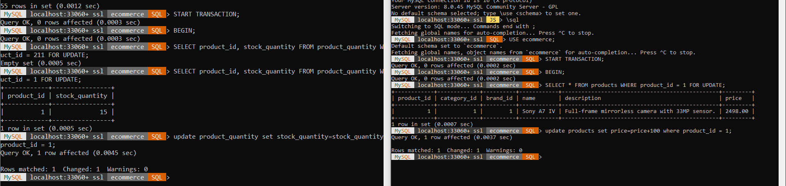
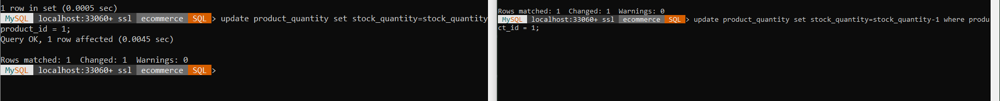
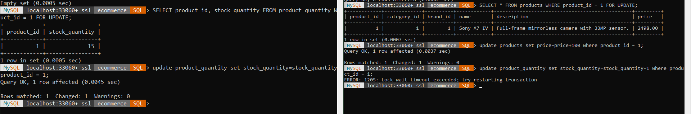
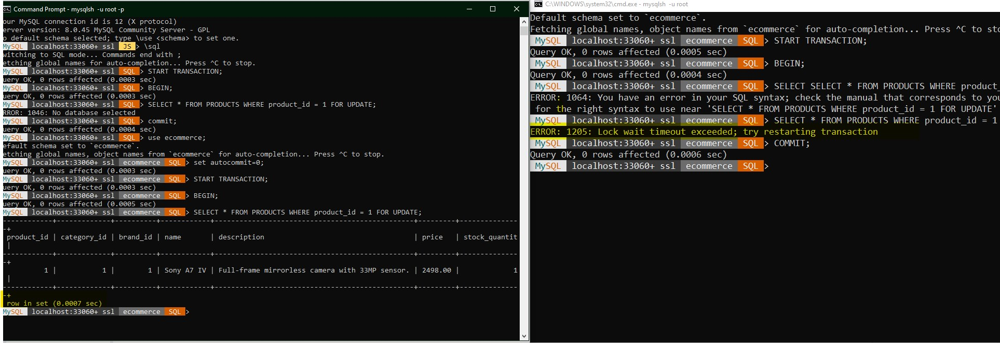

# DB Concurrency 
## Field Level Locks
- Task: *Write a transaction query to lock the field quantity with product id = 211 from being updated.*
- MySQL doesn't support field locks out of the box, but we can do a workaround to lock specific columns in specific row (field lock). 
### Solution: Another Table for a High Traffic Column
	
- The basic idea is to create a new table for the field quantity, that has a fk to the product table, and do the locking on that table. We then can regroup the two tables in one view so for easiness.
```sql
	USE ecommerce;
	
	CREATE TABLE product_quantity (
		product_id bigint unsigned PRIMARY KEY,
		stock_quantity  INT UNSIGNED NOT NULL DEFAULT 0,
		FOREIGN KEY (product_id) REFERENCES products (product_id) ON DELETE CASCADE
	);
	
	START TRANSACTION;
	BEGIN;
		INSERT INTO product_quantity (product_id, stock_quantity) select product_id, stock_quantity from products;
		ALTER TABLE products DROP COLUMN stock_quantity;
	COMMIT;
	
	-- now locking the quantity field for specific user - this will lock the field (column: quantity, row: product_id = 211) 
	-- from being updated while keeping other columns free to update.
	START TRANSACTION;
	BEGIN;
		SELECT product_id, stock_quantity FROM product_quantity WHERE product_id = 1 FOR UPDATE;
		-- do whatever operation.  
		-- example update product_quantity set stock_quantity=stock_quantity-1 where product_id = 1;   
	COMMIT;
	
	
	-- another user can still update other columns
	-- 
	USE ecommerce;
	START TRANSACTION;
	BEGIN;
		SELECT * FROM products WHERE product_id = 1 FOR UPDATE;
		-- do whatever operation.    
		-- example update products set price=price+100 where product_id = 1;   
	COMMIT;
```

- Practical demonstration
	- Disabled auto commit for demonstration.
    - Two users can update other fields than the field quantity in the same time.
		- 
	- Two users can't update the quantity in the same time, notice it is hanging on the right side.
		- 
    - Then it times out.
      - 

## Row Level Locks
- *Task:  Write a transaction query to lock row with product id = 211 from being updated.*
 Solution:
```
USE ecommerce;
START TRANSACTION;
BEGIN;
	SELECT * FROM PRODUCTS WHERE product_id = 211 FOR UPDATE;
    -- here we can update the row or do whatever operation
COMMIT;
```
- Practical demonstration
	- I disabled auto commit for demonstration.
	- Process one [on the left] acquired the lock for row 211;
	- Process two [on the right] tried to acquire the same update lock (X Lock) for the same row.
	- Process two hanged.
	- After a while, process two raised an error after the allowed time trying to acquire a lock has exceeded.
	- 
